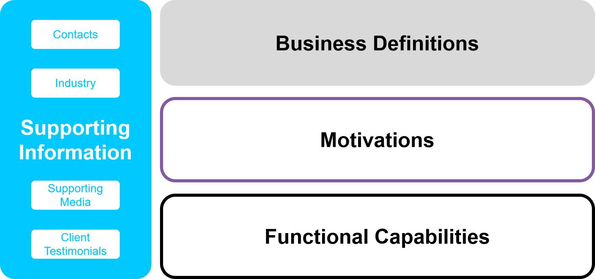
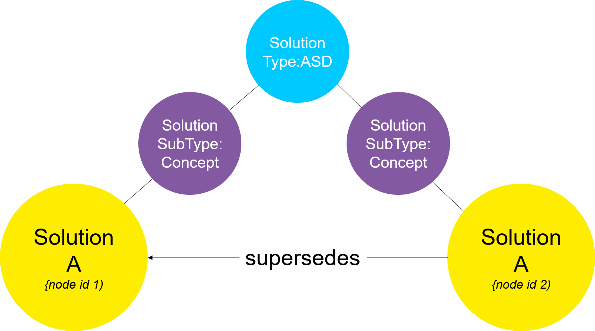

# Digital Explorer GitHub Reader

The purpose of the Digital Explorer GitHub Reader is to allow delivery and development teams to push and synchronize their solution descriptions directly into DXC Digital Explorer; allowing their content to be referenced across the Digital Explorer Platform.

## Approach
The Digital Explorer Solutions module stores solutions against a defined [:link: Graph metamodel](../MetaModels/SolutionMetaModel.md), the GitHub reader therefore requires solutions within GitHub to align to this metamodel. 

 

## GitHub Branches and Solution Models

To promote good practice within GitHub the following principle is applied to the Digital Explorer Solution reader.

**:scroll: A Branch equates to a single solution model within Digital Explorer**

## Installation

TBD

## Configurations

**Branch Selection**

It is possible to configure which branches within the repository are included within the solution reader sync.  

_Default value:_ master branch = sync branch

**Solution Type**
Users define the **Solution Type** and **Sub Type** within the individual solution files within each repostiory  Superseeded models 

## Connecting into the Knowledge Graph
In order to leverage the range of features across the Digital Explorer platform; during the synchronization the solution definition is broken down and connected to various elements within the Knowledge Graph

### Industries
The following relationships are created based on the content within the repository

`(Solution)-[:ASSIGNED]->(Subindustry)`

### Motivations and trends
To ensure the maximum benefit of adding the solution into the Digital Explorer Graph, each key element of text is analysed and matched against the Digital Explorer trends content; each match creates one of the following relationships

`(Solution)<-[:INFLUCENCE]-(BusienssTrend)` 
`(Solution)<-[:INFLUCENCE]-(TechnologyTrend)`

#### Text Properties

The following text properties are analysed against the Digital Explorer trend dataset

- Solution.name
- Solution.description
- Solution.elevatorPitch
- Solution.ValueProposition
- Solution.BusinessValue
- Solution.TechnicalValue
- Feature.name
- Feature.description

### Common Features
Any name matches against existing `Feature` nodes within the Digital Explorer graph are automatically selected and used to reduce duplicate `Feature` nodes.

## GitHub Solution Repository Structure
The Digital Explorer GitHub reader supports 2 base configurations within a GitHub repository

- Native (flat GitHub Structure)
- DXC Publisher (Agent Smith)

---

## Templates and Examples

Within both structures key files and content is required.

### Templates
- [Solution Overview](templates/Overview.md)
- [Business View](templates/BusinessView.md)
- [Motivations](templates/Motivations)
- [Features](templates/Features.md)
- [Contacts](templates/Contacts.md)
- [Account and Industry](templates/AccountAndIndsutry.md)
- [Media](templates/Media.md)
- [Client Testimonial](templates/ClientTestimonial.md)

#### Example

## Solution Types and Version Control

As defined above each **branch** within the GitHub repository aligns with a **single solution model** within Digital Explorer, solution models can be superseded within Digital Explorer by changing the Solution Type or Sub Type within the template files.  Superseded models are retained within Digital Explorer and a relationship to created between the two solution nodes.

  

The advantage of this approach allows solution owners to progress their solution development in a non-linear manner; a **concept** solution model can completed for a set of deliverables and be branched into a new **pilot** branch to continue development, both models will transferred into Digital Explorer and can be progressed on different development paths.
 
 

Note, while (4a) is supported by the reader (4b) is the recommended best practice.

## Post sync requirements

After the synchronization of the GitHub repository the following information is added to the GitHub repository

### DigitalExplorerSync.md
Direct link : 
Digital Explorer Solution id (current):
Digital Explorer Solution id (old) : 
Motivation matches:
Industry matches:
Common Features: