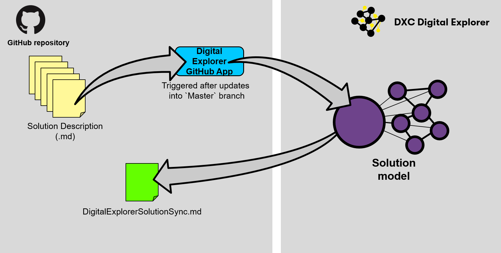

# Digital Explorer GitHub Reader

The purpose of the Digital Explorer GitHub Reader is to allow delivery and development teams to push and synchronize their solution descriptions directly into DXC Digital Explorer; allowing their content to be referenced across the Digital Explorer Platform.

## Approach
The Digital Explorer Solutions module stores solutions against a defined [Graph metamodel](../MetaModels/SolutionMetaModel.md), the GitHub reader therefore requires solutions within GitHub to align to this metamodel. 

 

## How to install

TBD

### Transferring and connecting into the Knowledge Graph
In order to leverage the range of features across the Digital Explorer platform; during the synchronization the solution definition is broken down and connected to various elements within the knowledge Graph

#### Industries
The following relationships are created based on the content within the repository

`(Solution)-[:ASSIGNED]->(Subindustry)`

#### Motivations and trends
To ensure the maximum benefit of adding the solution into the Digital Explorer Graph, each key element of text is analysed and matched against the Digital Explorer trends content; each match creates one of the following relationships

`(Solution)<-[:INFLUCENCE]-(BusienssTrend)` 
`(Solution)<-[:INFLUCENCE]-(TechnologyTrend)`

##### Text Properties

The following text properties are analysed against the Digital Explorer trend dataset

- Solution.name
- Solution.description
- Solution.elevatorPitch
- Solution.ValueProposition
- Solution.BusinessValue
- Solution.TechnicalValue
- Feature.name
- Feature.description

#### Common Features
Any name matches against existing `Feature` nodes within the Digital Explorer graph are automatically selected and used to reduce duplicate `Feature` nodes.

## GitHub Solution Repository Structure
The Digital Explorer GitHub reader supports 2 base configurations within a GitHub repository

- Native (flat GitHub Structure)
- DXC Publisher (Agent Smith)

## Key Files

Within both structures key files and content is required.

---

## Templates and Examples

### Templates
- [Solution Overview](templates/Overview.md)
- [Business View](templates/BusinessView.md)
- [Motivations](templates/Motivations)
- [Features](templates/Features.md)
- [Contacts](templates/Contacts.md)
- [Account and Industry](templates/AccountAndIndsutry.md)
- [Media](templates/Media.md)
- [Client Testimonial](templates/ClientTestimonial.md)

### Example

[**View solution within Digital Explorer**]()

---

## Solution types and versions
### Scenario 1: Same repository/change solution type
Where the solution definition is managed within a single repository, changing the solution type (within the `Master` branch), will trigger a new solution model to be created within Digital Explorer.   The original solution model and type will remain in place and the new version will be created based on the content defined within the current repository structure.

A relationship between each solution is created to capture and track the iterations made to the solution over a period of time

~~~
(Solution)-[:SPECIALIZED]->(Solution)
~~~

### Scenario 2: Fork an existing solution into a new repository
In the event an existing DE syncronziated solution repository is forked into a new variant and the GitHub application is added to the solution, a new solution model is created within the Digital Explorer solution and a relationship between the existing solution within Digital Explorer; the `Current` and `old` solution id's are referenced and changed within the `DigitalExplorerSync.md` file

~~~
(Solution)-[:SPECIALIZED]->(Solution)
~~~

---

## Roadmap
A future release of Digital Explorer will auto-populate a new solution repository within GitHub based on the "ideas" definition within Digital Explorer.   The repository will be set-up with initial content within all the required template files and the GitHub app automatically enabled to ensure the solution model remains in sync.

**@GlennA - My thinking here is the repo is also preconfigured under Agent Smith/Publisher**

---

## Post sync requirements

After the synchronization of the GitHub repository the following information is added to the GitHub repository

### DigitalExplorerSync.md
Direct link : 
Digital Explorer Solution id (current):
Digital Explorer Solution id (old) : 
Motivation matches:
Industry matches:
Common Features:

---

## Advanced requirements

how to automate the update of the template files which use/require meta data (e.g. Solution types)?