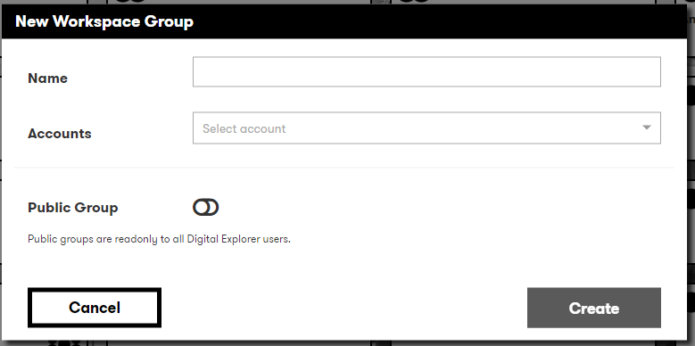
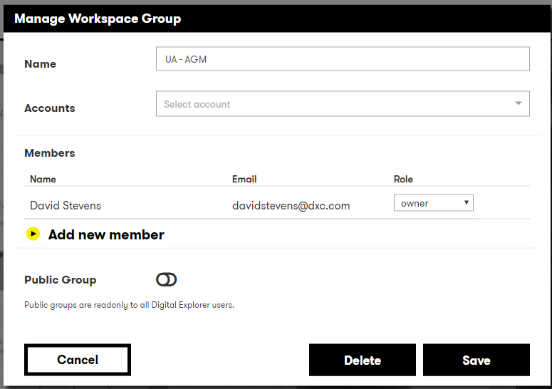
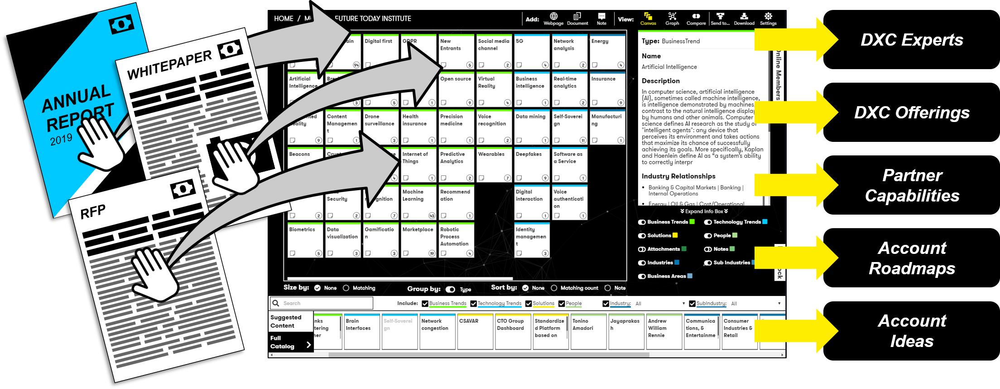
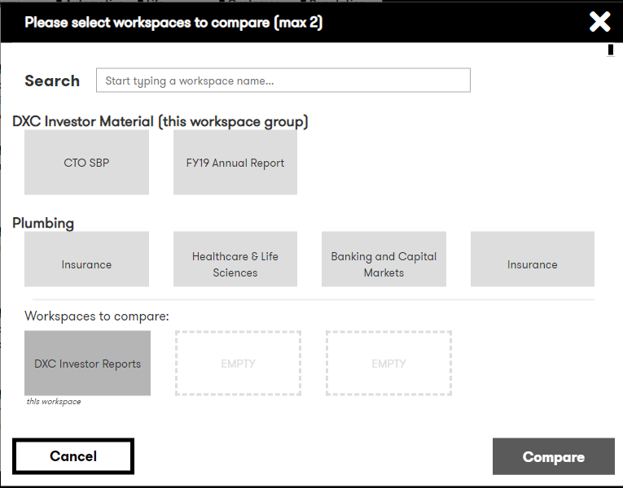
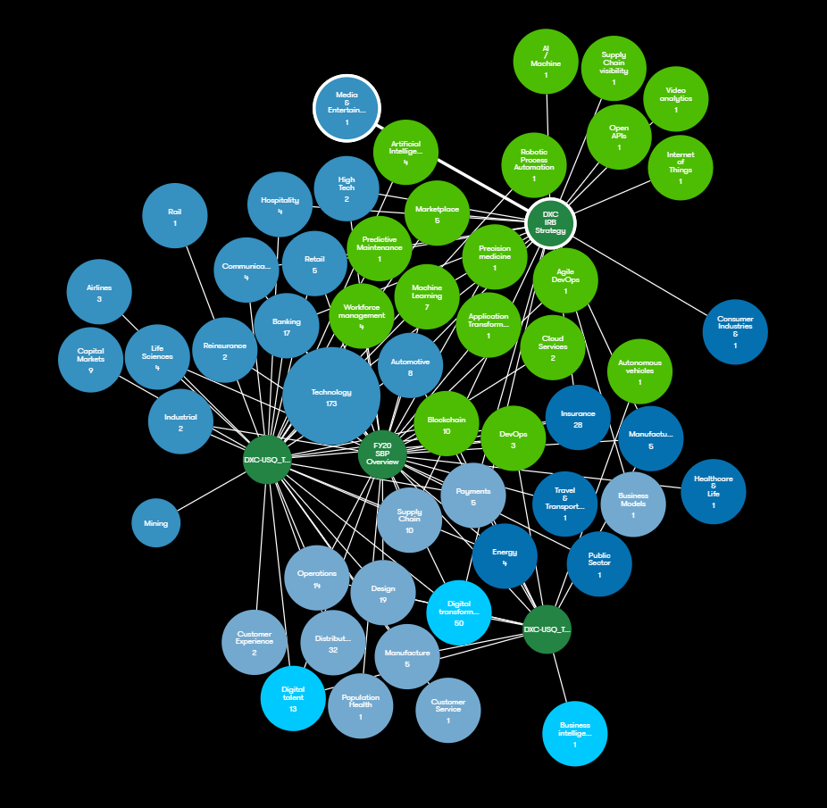
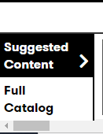
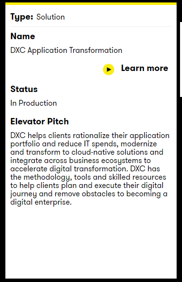

# Digital Explorer level 200 training

The level 200 training is intended to provide an end-2-end walkthrough of a client use case through the Digital Explorer platform.

_Scenario_

New client visit to a **DXC Innovation** or **Digital Transformation Centre**.   The scenario addresses the first 2 stages of a client engagement journey

 

**Aim**
Understand the client's challenges and how DXC is a strong partner for them to work with

## Pre-requisites 
:information_desk_person: The DXC Digital Explorer White and Yellow belt training provides a good introduction to the modules and elements outlined within this guide.

- [White belt training](https://dxc.sabacloud.com/Saba/Web_spf/NA2PRD0005/app/shared;spf-url=common%2Flearningeventdetail%2Fcurra000000000004384)
- [Yellow belt training](https://dxc.sabacloud.com/Saba/Web_spf/NA2PRD0005/app/shared;spf-url=common%2Flearningeventdetail%2Fcurra000000000004500)

## Getting ready

1. Create a Workgroup within Digital Explorer Workspaces

[DXC Digital Explorer Workspace Module](https://digitalexplorer.dxc.com/dew) 
 

#### Optional set-up tasks

1. Associated the workgroup with an account
2. Invite colleagues to join the workgroup

Within the workgroup, select the **Settings** icon in the top right of the toolbar

 
 

 
:information_desk_person: :email: New members receive an email with details of the group and how to access 

## Prepare
1. Familiarize yourself with the DXC Industry Business Value Framework (iBVF) structure for the client's industry.  
The iBVF is a key asset within DXC as it breaks down the key elements within a target industry.  DXC Digital Explorer leverages the same framework to position key industry trends.   

2. Review the key trends 
For the client's primary industry review the most referenced trends within the [Digital Explorer Trends module.](https://digitalexplorer.dxc.com/de) 
a. Select Industry Trends 
b. Select the required Industry 
c. Select the required sub-industry 
d. Review each of the business areas to get a sense of the key trends within each area  

:bulb: As you load in content into your **workspace**, some of these **trends** should start to appear. 

### Present some initial viewpoints
Digital Explorer includes some introduction material you can use within the client meeting
- [DXC digital Transformation Story](https://digitalexplorer.dxc.com/pb/playbook/597635)
- [DXC New Orleans Digital Transformation Center](https://digitalexplorer.dxc.com/pb/playbook/782289)
- [DXC Key trends for 2020](https://digitalexplorer.dxc.com/pb/playbook/787028)

## Be Relevant
:bulb: Prepare this before the meeting but also plan to run this live with the client. 

The aim of "be relevant" to map the clients challenges to existing and potential new solutions

 

:bulb: Suggested material

- Annual reports
- Strategy paper
- Digital transformation related press releases

:bulb: Create a separate **Workspace** for each type of content - This will allow you to **Compare** workspaces

### Reading in content

You can **Read in** content from either a **Local document** or a **web address**

:point_right:    
  Select either **Read Webpage** or **Read Document** from the toolbar

### Comparing content
The DXC Digital Explorer team have loaded in a number of key assets into the Digital Explorer solution, this information can be used as a reference point against your workspace content. 

**Examples**
- Compare a clients annual report against a DXC industry primer document
- Compare a clients annual report against a DXC Digital Directions paper

:point_right:   
Select **Compare** from the **Views** section from the toolbar 
 

:bulb: You can compare you to 3 workspaces 
:bulb: You can search to filter the list of available workspaces 
:bulb: You can compare against any workspace you are a **member** of and any **public** workspaces shared by your peers 
 
:art: Example of a comparison between a client's investor report and one of the DXC digital direction papers

 
:bulb: You can click on any section to zoom in 
:bulb: Selecting any idea will update the information panel 

### Shared Connections
If you have included multiple documents within the same workspace, you can show a client the relationships between the key points and each document.

:point_right:   
Select **Graph** from the **Views** section from the toolbar  

Example of a Graph view.. 
:art:  
:bulb: You can adjust the size based on number of **relationships** or **matches** 
:bulb: Selecting any idea will update the information panel 

### Finding solution
After you have loaded or added content into your Workspace you can use the information to find any existing solutions which match the requirements captured.  
From the bottom Dock, select **Suggested Content** 
  

:bulb: You can filter against **solutions** types and **industries** 
 
:bulb: You can select to show or hide **People** or **Solutions** within the results set 
:bulb: A single click on a Solution card will show the name and elevator pitch within the information panel 
:bulb: From the information panel you can select to **Learn more** about the solution, whereby a new tab is opened with the full solution datasheet 
 
:bulb: You can **Drag and Drop** any card from the **dock** into your **Workspace** 

#### Solution Filters
Some example solution filters

- To show any **DXC demos** : Select **Solution Type : Standard Solution**  and **SubType : DXC Demo**
- To show any **DXC offerings** : Select **Solution Type : Reference Datasets**  and **SubType : DXC Offering Family**
- to show any **Client production solutions** : Select **Solution Type : Accelerated Solution Development** 
  :bulb: For production solutions use the **SubType** filter to refine the type of solution, e.g. **MVP**, **Pilot**, **Production**  

 

### Publishing your results

As you walkthrough your **Workspaces**, **Comparison** and **Graph** Views you may wish to publish and share these with the client or account team after the workshop; these can be published using the **Digital Explorer Playbook module**.

:bulb: You may also want to prepare a **Playbook** before the workshop and use the Playbook to help with the client discussion

:bulb: You can create a **Playbook** directly within your **Workspace** or **Workgroup** 

:bulb: In order for a **client** access a **Playbook**, they must first register on the Digital Explorer platform 

:bulb: All playbook contacts can gain insights into the number of views and users of their playbooks, this is available via the **My Playbooks** menu item 

#### Creating a Playbook within a Workspace
Within your **Workspace canvas** select the "Send To" option from the toolbar 

#### Creating a Playbook within a Workgroup
Within your main **Workgroup** area, expand the **Playbooks** section and select **Create New** 

:bulb: However you create your **Playbook**, it will appear in your list of Playbooks in your main **Workgroup** view

### Next steps

From the information captured you have enough information to start developing an **Innovation Agenda**, **Digital Blueprint** and capturing potential **ideas** to address the client's needs

